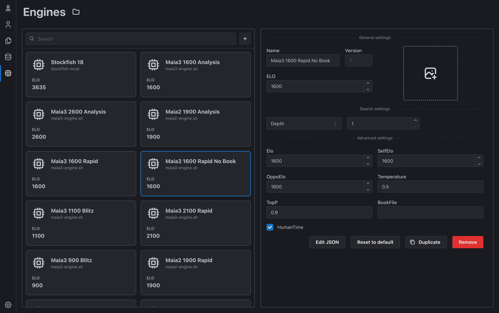
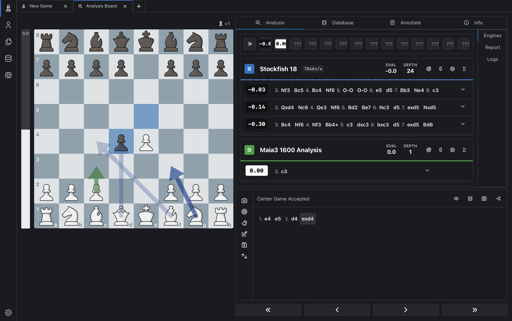
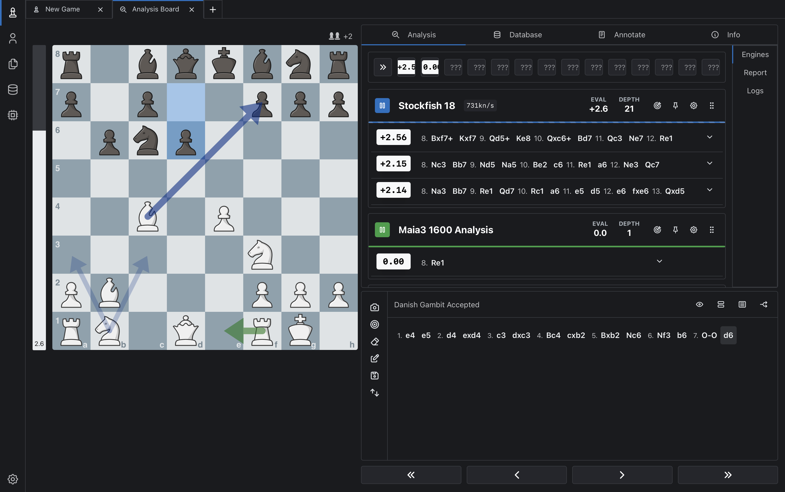
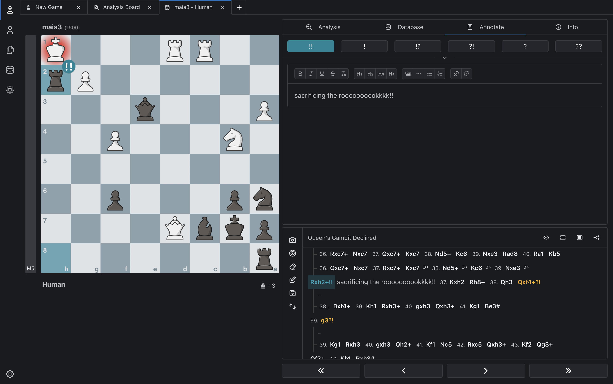
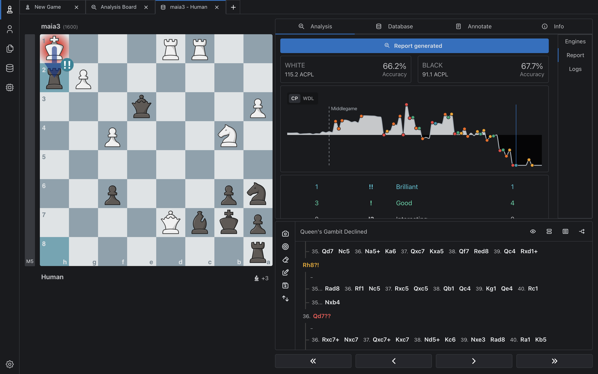

# maia3-local-stack

Run Maia 3 locally as a human-like UCI chess engine, with En Croissant integration, Stockfish side-by-side analysis, game annotation and reports, and locally generated Lichess-based opening books for Linux and Apple Silicon macOS.

## Status

This repository is the clean Maia 3 successor to the earlier Maia 2 local-stack project.

Current scope:
- install Maia 3 in a local venv from the upstream GitHub repo
- launch Maia 3 through a thin compatibility wrapper with optional opening-book and HumanTime support
- use optional Polyglot books from the standalone Chess Opening Book Builder
- document Linux and Apple Silicon macOS setup

Planned next:
- optional installer polish / post-install smoke test

## Quick start

```bash
git clone https://github.com/Dash1971/maia3-local-stack.git
cd maia3-local-stack
chmod +x *.sh
./setup-maia3.sh
```

That creates a local install under `~/chess/maia3-engine/` and prints the engine path to use in your GUI.

On Linux, `setup-maia3.sh` deliberately installs the CPU-only PyTorch build to avoid dragging in a multi-gigabyte CUDA stack on non-GPU systems.

To build optional opening books, use the standalone
[Chess Opening Book Builder](https://github.com/Dash1971/chess-opening-book-builder):

```bash
git clone https://github.com/Dash1971/chess-opening-book-builder.git
cd chess-opening-book-builder
chmod +x build-books.sh
./build-books.sh --preset maia3-1600-rapid
```

That preset writes `lichess_1600_rapid_2024-01.bin` plus a matching JSON
provenance sidecar under `~/chess/books/`. Run `./build-books.sh --help` for
other ratings, speeds, months, and thresholds.

Opening books are optional. Maia3 can play directly from the position without a
book; `BookFile` is there when you want a local Polyglot book to steer the
opening phase toward rating/time-control-specific human games.

Quick verification after setup:

```bash
~/chess/maia3-engine/maia3-engine.sh --list-models
printf 'uci\nisready\nquit\n' | ~/chess/maia3-engine/maia3-engine.sh
```

Deterministic wrapper/book fixture check:

```bash
~/chess/maia3-engine/venv/bin/python tests/generate_startpos_book.py
printf 'uci\nsetoption name BookFile value %s\nposition startpos\ngo\nquit\n' \
  "$PWD/tests/fixtures/startpos-e2e4.bin" | ~/chess/maia3-engine/maia3-engine.sh
```

That fixture path should emit both:
- `info string book move`
- `bestmove e2e4`

For the exact En Croissant setup flow, use:
- [GUIDE.md](GUIDE.md) for Linux
- [GUIDE-macOS.md](GUIDE-macOS.md) for Apple Silicon macOS

## What the setup looks like

### Configure separate play and analysis profiles

En Croissant exposes Maia3's rating and sampling controls alongside this
wrapper's optional opening-book and human-timing controls. Multiple profiles can
point to the same launcher, so you can keep distinct configurations for rapid,
blitz, analysis, different ratings, and book/no-book play.



For a playing profile, set `Elo`, `SelfElo`, and `OppoElo` to the rating you want
Maia3 to model. Enable `HumanTime` if you want a short artificial delay before
the move appears. For an analysis profile, leave `HumanTime` disabled so the
recommendation appears immediately.

### Compare human-like choices with engine-best moves

Run Maia3 and Stockfish together on En Croissant's analysis board. Stockfish
shows searched engine evaluations and principal variations; Maia3 shows the move
its policy considers most characteristic for the configured players. A Maia3
score is therefore not a centipawn evaluation comparable to Stockfish's score.





### Annotate games, save databases, and generate reports

After playing, use En Croissant to save the game in a database and add symbols,
comments, and variations. Its Stockfish-backed report view can add accuracy,
ACPL, an evaluation graph, and move classifications such as brilliant moves
(sometimes called "brillies"). These annotation, database, and report features
come from En Croissant and its analysis engine; Maia3 supplies the human-like
opponent or comparison move.





## Temperature and TopP

Maia3 predicts a probability distribution over legal moves. `Temperature` and
`TopP` control how the engine selects a move from that distribution; they do not
change the neural-network weights or make Maia3 search like Stockfish.

| Setting | Effect |
|---|---|
| `Temperature=0` | Deterministic: always choose the highest-probability legal move (argmax). |
| Higher `Temperature` | Sample more broadly from Maia3's move distribution, adding variety and allowing lower-probability moves to appear. |
| `TopP=1.0` | Disable nucleus filtering; retain the complete legal-move distribution. |
| Lower `TopP` | Before sampling, retain only the smallest group of top moves whose cumulative probability reaches the chosen threshold. |

Practical starting points:

- **Most reproducible / top-1 policy:** `Temperature=0`, `TopP=1.0`. Use this
  when you want Maia3's single most likely human move for each position. With
  deterministic selection, `TopP` normally has no practical effect because the
  highest-probability move remains available.
- **Human-like variety:** start with `Temperature=0.5`, `TopP=0.9`, then adjust.
  This produces less repetitive play but can also select lower-probability—and
  sometimes weaker—moves.
- **Upstream defaults:** `Temperature=1.0`, `TopP=1.0`. This samples from the
  full learned distribution and produces the most variety of these presets.

Temperature and TopP are not calibrated Elo controls. A sampled Maia3 profile
may play differently from a deterministic profile at the same displayed rating,
but there is no supported conversion such as "setting Temperature to zero adds
200 Elo." Calibrate a training opponent from your own results: keep the sampling
settings fixed, play a meaningful set of games, and then adjust `Elo`.

### What Maia3's Elo means

Maia3 was trained to predict moves from **Lichess blitz games** played from
January 2023 through July 2025. Its `SelfElo` and `OppoElo` inputs condition the
model on the ratings of the player to move and the opponent; `Elo` sets both at
once. The number describes the player population Maia3 is trying to imitate—not
a guaranteed match rating for the engine under every GUI, time control, opening
book, or sampling configuration.

The Chessformer paper reports 57.1% move-matching accuracy for the 79M model on
a Lichess-blitz test set using top-1 prediction. That is a prediction metric, not
a claim that every `Elo` setting has been independently calibrated through match
play. Blitz and rapid ratings also vary by player and should not be converted by
a universal fixed offset. If you play Maia3 at rapid time controls, the extra
thinking time can benefit you while Maia3 still performs one policy inference;
use your actual match results to choose a useful training level.

Sources: [official Maia3 UCI options](https://github.com/CSSLab/maia3#uci-options)
and [Chessformer paper, Section 4](https://arxiv.org/html/2605.19091v1#S4).

## Files

| File | Purpose |
|---|---|
| `setup-maia3.sh` | Create a local Maia 3 environment and install a launcher |
| `maia3-engine.sh` | Thin launcher for the local wrapper |
| `maia3_wrapper.py` | UCI compatibility layer adding `BookFile` and `HumanTime` |
| `GUIDE.md` | Linux setup notes |
| `GUIDE-macOS.md` | Apple Silicon macOS setup notes |

## Notes

- Default model is currently `maia3-79m`.
- If you want a lighter fallback, set `MAIA3_MODEL=maia3-23m` before launching or running setup.
- The setup script installs Maia3 from the upstream GitHub repository, not from PyPI.
- The local wrapper adds `BookFile` and `HumanTime` while keeping upstream Maia3 as the underlying move picker.
- In En Croissant, you can create multiple engine entries that point to the
  same `maia3-engine.sh` launcher. Treat each entry as a separate profile:
  customize its UCI options independently. A common setup is one Maia3 profile
  for play with your target `Elo`, a matching opening `BookFile`, and
  `HumanTime=true`; and a second Maia3 analysis profile at the same `Elo` with
  `HumanTime=false` so recommended moves appear without the artificial delay.
- `BookFile` has been smoke-tested with a deterministic Polyglot fixture from the starting position.
- The first engine run downloads the chosen checkpoint from Hugging Face and reuses the local cache after that.
- The wrapper is intentionally thin: upstream Maia3 stays authoritative for model behavior.
- `tests/generate_startpos_book.py` is easiest to run with the installed engine venv Python, since that environment already has `python-chess`.

## License

MIT for repository code and scripts. Maia 3 model weights and upstream engine code have their own licenses; see the upstream CSSLab repository and Hugging Face model pages.
